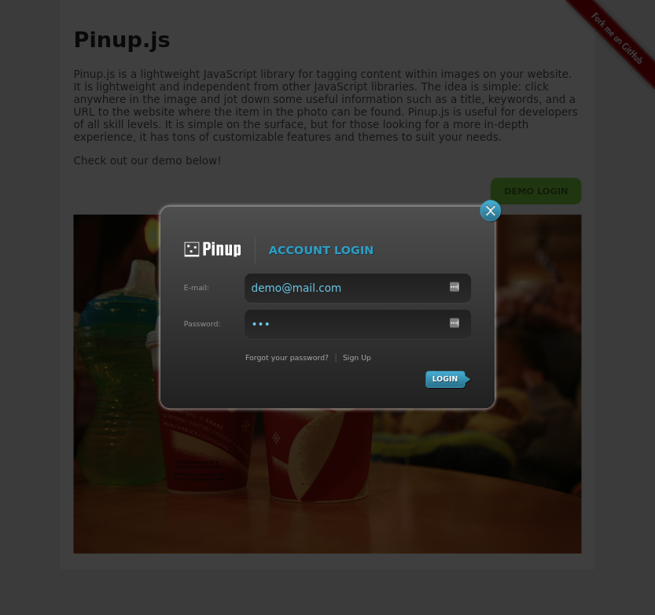
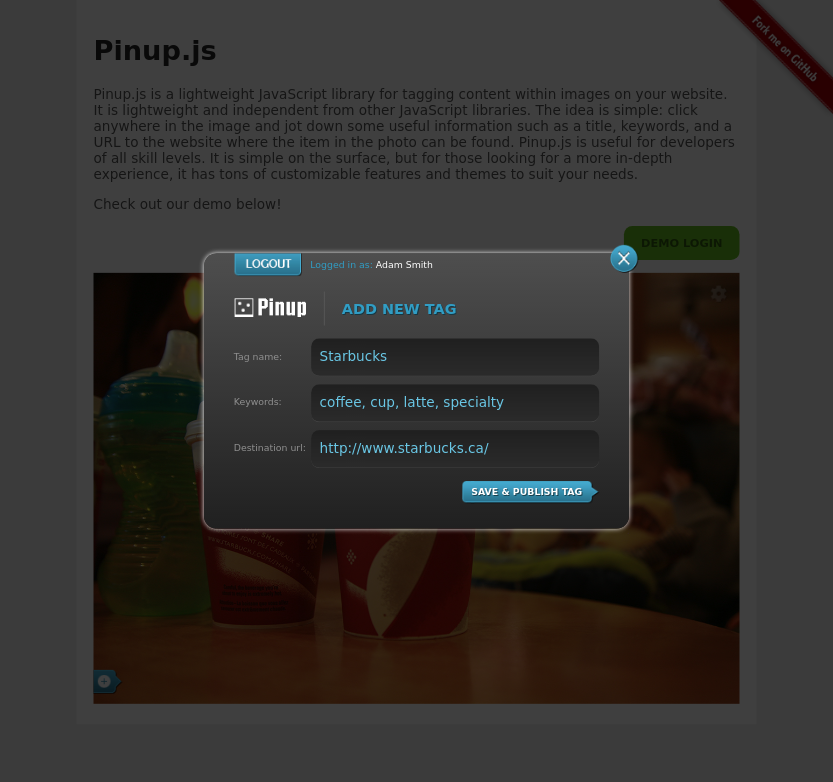
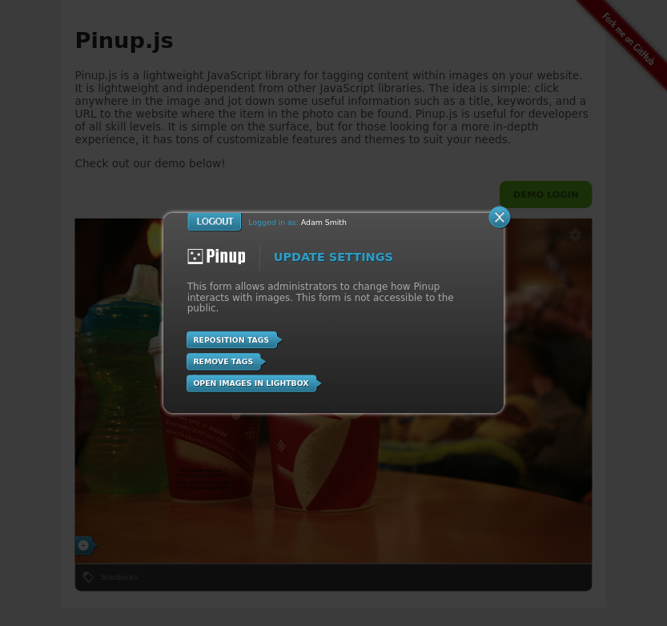
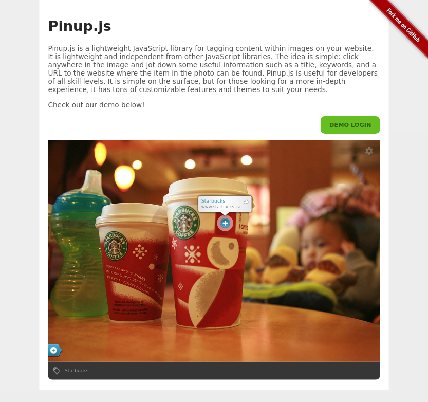

# Pinup.js

Pinup.js is a lightweight JavaScript library for tagging content within images on your website.
It is lightweight and independent from other JavaScript libraries.
The idea is simple: click anywhere in the image and jot down some useful information such as a title, keywords, and a URL to the website where the item in the photo can be found.
Pinup.js is useful for developers of all skill levels.
It is simple on the surface, but for those looking for a more in-depth experience, it has tons of customizable features and themes to suit your needs.

---

### Requirements

The following programs must be install on your machine before you may install.

- [Node.js](https://nodejs.org/en/download/)
- [Vagrant](https://www.vagrantup.com/downloads.html)
- [VirtualBox](https://www.virtualbox.org/wiki/Downloads)

### Install

```bash
npm install
npm run build
vagrant plugin install vagrant-hostsupdater
vagrant up
```

- The server will now be available on the [pinup.dev](http://pinup.dev/) domain.
- phpMyAdmin will be available at [pinup.dev/phpmyadmin](http://pinup.dev/phpmyadmin).

### Settings

| Name                         | Default                 | Description                                                                                                                                                                                                                                                                                                                                                        |
|------------------------------|-------------------------|--------------------------------------------------------------------------------------------------------------------------------------------------------------------------------------------------------------------------------------------------------------------------------------------------------------------------------------------------------------------|
| loadAll                      | `false`                 | Ignore classes and load all images.                                                                                                                                                                                                                                                                                                                                |
| loadImages                   | `[]`                    | References to images (`id`, `src`, `dom`) you wish to be loaded.                                                                                                                                                                                                                                                                                                   |
| nMinWidth                    | `250`                   | Minimum width threshold for images to be loaded.                                                                                                                                                                                                                                                                                                                   |
| nMinHeight                   | `200`                   | Minimum height threshold for images to be loaded.                                                                                                                                                                                                                                                                                                                  |
| allowFile                    | `"jpg,jpeg,png"`        | The accepted file types when checking for images on a page.                                                                                                                                                                                                                                                                                                        |
| smartLoad                    | `true`                  | Hold off on loading images until they are visible.                                                                                                                                                                                                                                                                                                                 |
| forceListen                  | `false`                 | Checks the dom for new images on every scroll event. Because this is more intensive, you should only use this if images are being dynamically added.                                                                                                                                                                                                               |
| scrollDelay                  | `300`                   | How many milliseconds to wait after a scroll event before checking for visible images.                                                                                                                                                                                                                                                                             |
| alwaysShowTags               | `true`                  | If false, tags will only be visible on image hover.                                                                                                                                                                                                                                                                                                                |
| keyListener                  | `true`                  | Listen for keypress events such as `ENTER` to submit forms, `ESC` to close windows, `F2` to toggle UI, and `LEFT ARROW` / `RIGHT ARROW` to navigate the lightbox.                                                                                                                                                                                                  |
| cssHelper                    | `true`                  | Copy styles from the original image to the wrapper element.                                                                                                                                                                                                                                                                                                        |
| posHelper                    | `true`                  | Adds offset to images that become misaligned after being loaded.                                                                                                                                                                                                                                                                                                   |
| animations                   | `true`                  | If false, UI animations will be disabled.                                                                                                                                                                                                                                                                                                                          |
| navAniSpeed                  | `250`                   | Animation speed, in milliseconds, for image overlay buttons.                                                                                                                                                                                                                                                                                                       |
| themeFile                    | `""`                    | Provide a CSS file relative to `frontend-themes/css/` which will be used instead of the default theme.                                                                                                                                                                                                                                                             |
| allowThemeManager            | `false`                 | If true, will check `themeFile` and load the theme if it exists.                                                                                                                                                                                                                                                                                                   |
| allowLocalStorage            | `false`                 | Leverage the browsers local storage to cache `checkSite` and `checkImage` requests to speed up load times.                                                                                                                                                                                                                                                         |
| allowBottomLinks             | `false`                 | Add links for each tag below the image for better accessibility.                                                                                                                                                                                                                                                                                                   |
| allowShare                   | `true`                  | Enable share buttons for each tag.                                                                                                                                                                                                                                                                                                                                 |
| dotSize                      | `"medium"`              | Choose between 3 possible tag sizes (`small`, `medium`, `large`).                                                                                                                                                                                                                                                                                                  |
| dotOutlineSize               | `6`                     | Size of the tag outline in pixels which is visible on hover.                                                                                                                                                                                                                                                                                                       |
| canvas.cornerRadius          | `5`                     | The corner radius, in pixels, of the tag's tooltip.                                                                                                                                                                                                                                                                                                                |
| canvas.tailWidth             | `19`                    | The pointer width, in pixels, of the tag's tooltip *(Should be an odd number to center align the pointer)*.                                                                                                                                                                                                                                                        |
| canvas.tailHeight            | `8`                     | The pointer height, in pixels, of the tag's tooltip.                                                                                                                                                                                                                                                                                                               |
| canvas.stroke                | `false`                 | Enable stroke, defined by `canvas.theme.stroke*`, for the tag's tooltip.                                                                                                                                                                                                                                                                                           |
| canvas.shadow                | `true`                  | Enable stroke, defined by `canvas.theme.shadow*`, for the tag's tooltip.                                                                                                                                                                                                                                                                                           |
| canvas.theme.backgroundStyle | `"radial"`              | The tooltip's background style (`radial`, `linear`, `solid`).                                                                                                                                                                                                                                                                                                      |
| canvas.theme.backgroundColor | `"0-#FFFFFF 1-#CCCCCC"` | Gradient backgrounds follow this structure: "`<color-stop>`-`<color-hex>`" and are separated by a space as demonstrated by the default value. Solid colors are simply the color's hex code.                                                                                                                                                                        |
| canvas.theme.strokeWidth     | `1`                     | The tooltip's stroke width, in pixels *(min value of 1)*.                                                                                                                                                                                                                                                                                                          |
| canvas.theme.strokeColor     | `"#000000"`             | The tooltip's stroke color, as a hex code.                                                                                                                                                                                                                                                                                                                         |
| canvas.theme.shadowOffsetX   | `0`                     | The tooltip's horizontal shadow distance, in pixels *(negative values are allowed)*.                                                                                                                                                                                                                                                                               |
| canvas.theme.shadowOffsetY   | `0`                     | The tooltip's vertical shadow distance, in pixels *(negative values are allowed)*.                                                                                                                                                                                                                                                                                 |
| canvas.theme.shadowBlur      | `5`                     | The blur distance, for the tooltip's shadow in pixels.                                                                                                                                                                                                                                                                                                             |
| canvas.theme.shadowColor     | `"#000000"`             | The tooltip's shadow color, as a hex code.                                                                                                                                                                                                                                                                                                                         |
| tooltip                      | `true`                  | Show a tooltip on tag hover.                                                                                                                                                                                                                                                                                                                                       |
| tooltipOrientation           | `"top"`                 | The tooltip orientation relative to the tag. Can be one of these possible values: (`up`, `right`, `bottom`, `left`).                                                                                                                                                                                                                                               |
| tooltipURL                   | `true`                  | Show URL in the tooltip.                                                                                                                                                                                                                                                                                                                                           |
| altImageSrc                  | `"pinsrc"`              | A custom attribute that is used as an alternate `src` from which to load image tags. This can be useful if an image is hosted locally, but you wish to load tags from a remote image source. The value does not need to match your domain, but it must be an absolute URL. For example: ``. |
| activeParentClass            | `"allpins"`             | If `loadAll` is false, then use this class on the parent element of images you wish to load.                                                                                                                                                                                                                                                                       |
| activeChildClass             | `"pinimg"`              | If `loadAll` is false, then use this class on images you wish to load.                                                                                                                                                                                                                                                                                             |
| jsonpTimeout                 | `30000`                 | The timeout length, in milliseconds, for API requests.                                                                                                                                                                                                                                                                                                             |
| custom                       | `{}`                    | Custom settings for individual images using their id's as the property and a settings object as the value. Example: `{"myImage":{"tooltip":false}}`.                                                                                                                                                                                                               |

### Methods

| Name     | Parameters        | Description                                                                                                                                                                                                                                                                          |
|----------|-------------------|--------------------------------------------------------------------------------------------------------------------------------------------------------------------------------------------------------------------------------------------------------------------------------------|
| onReady  | `context`         | This method is called once the system has finished the startup process, which includes binding event listeners, checking browser support, inserting required DOM elements, loading dependencies, checking for custom themes, checking the user login state, and checking for images. |
| onLogin  | `context`, `data` | This method is called once a user has successfully logged in.                                                                                                                                                                                                                        |
| onLogout | `context`         | This method is called once a user has logged out.                                                                                                                                                                                                                                    |

### Screenshots





